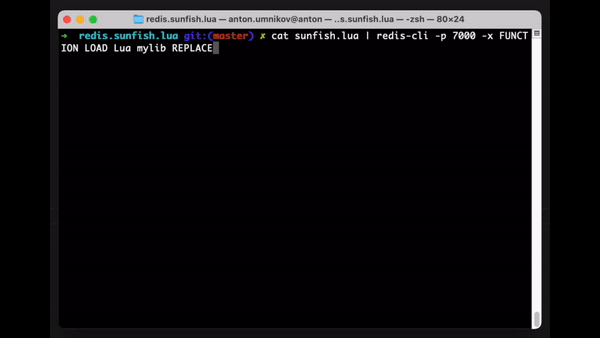

redis.sunfish.lua
=================

Tiny and basic chess engine for lua, enabled for running as Lua script in the Redis database.

- Redis port of https://github.com/soumith/sunfish.lua 
- Which is a Port of https://github.com/thomasahle/sunfish

## Usage



### As EVALSHA script:

```bash
redis-cli -x script load < sunfish.lua
"3438f0ce3d5b00844625ee078b772ab5263ca199"
redis-cli                             
127.0.0.1:6379> evalsha 3438f0ce3d5b00844625ee078b772ab5263ca199 0
 1) "                    "
 2) " 8  r n b q k b n r "
 3) " 7  p p p p p p p p "
 4) " 6  . . . . . . . . "
 5) " 5  . . . . . . . . "
 6) " 4  . . . . . . . . "
 7) " 3  . . . . . . . . "
 8) " 2  P P P P P P P P "
 9) " 1  R N B Q K B N R "
10) "                    "
11) "    a b c d e f g h "
12) "your move: "
127.0.0.1:6379> evalsha 3438f0ce3d5b00844625ee078b772ab5263ca199 0 e2e4
 1) "                    "
 2) " 8  r n b q k b . r "
 3) " 7  p p p p p p p p "
 4) " 6  . . . . . n . . "
 5) " 5  . . . . . . . . "
 6) " 4  . . . . P . . . "
 7) " 3  . . . . . . . . "
 8) " 2  P P P P . P P P "
 9) " 1  R N B Q K B N R "
10) "                    "
11) "    a b c d e f g h "
12) "your move: "
(1.58s)
127.0.0.1:6379> evalsha 3438f0ce3d5b00844625ee078b772ab5263ca199 0 d2d3
 1) "                    "
 2) " 8  r . b q k b . r "
 3) " 7  p p p p p p p p "
 4) " 6  . . n . . n . . "
 5) " 5  . . . . . . . . "
 6) " 4  . . . . P . . . "
 7) " 3  . . . P . . . . "
 8) " 2  P P P . . P P P "
 9) " 1  R N B Q K B N R "
10) "                    "
11) "    a b c d e f g h "
12) "your move: "
(2.50s)
127.0.0.1:6379> 
```

### As Redis Function (Redis 7.0+)

Note - adjust if/else block at the end of the file to switch to function mode

```bash
cat sunfish.lua | redis-cli -p 7000 -x FUNCTION LOAD Lua mylib REPLACE
redis-cli -p 7000
127.0.0.1:7000> FCALL chess 0 e2e4
```